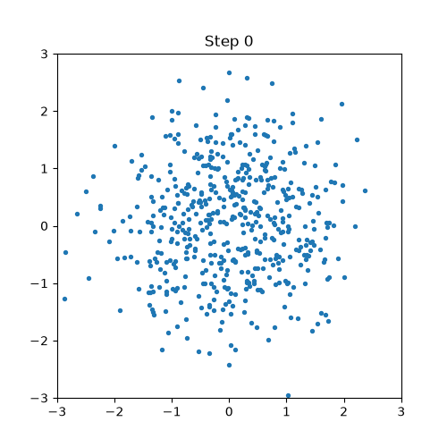
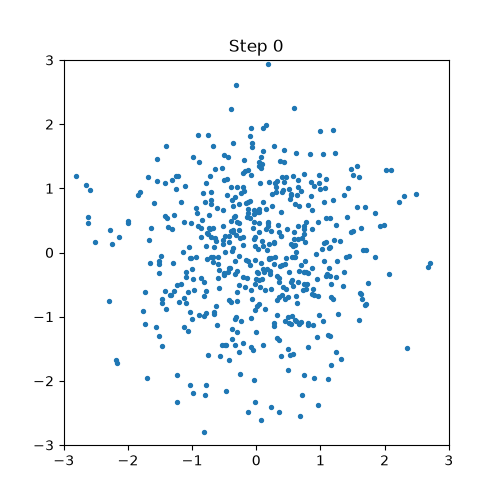
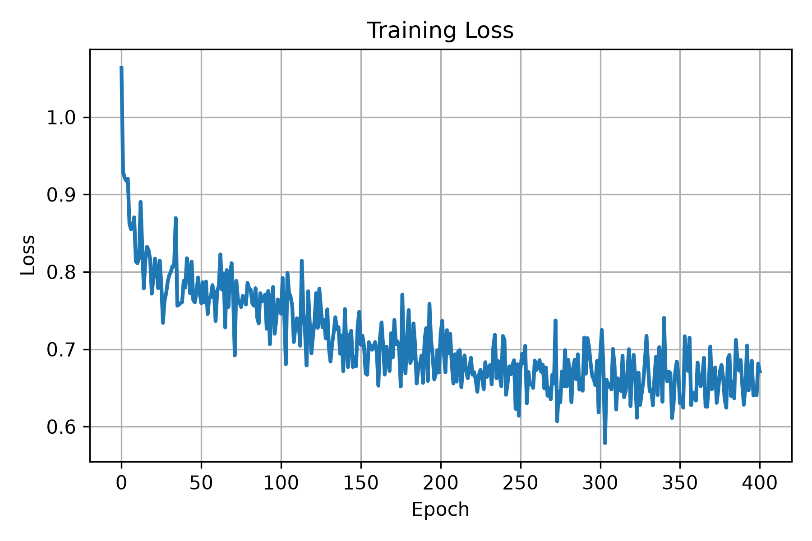

# Diffusion Models from Scratch

> A compact PyTorch implementation of **DDPM** and **DDIM** on a 2D Swiss Roll—small enough to read end to end, yet complete enough to train, sample, and visualize every reverse-diffusion step.

This repository focuses on the mechanics behind diffusion models: the noise schedule, timestep conditioning, noise-prediction objective, and two different reverse samplers. It uses no high-level diffusion library.

<table>
  <tr>
    <th>DDPM · 100 stochastic updates</th>
    <th>DDIM · 20 selected time levels, η = 0</th>
  </tr>
  <tr>
    <td></td>
    <td></td>
  </tr>
</table>

## At a glance

| | Default experiment |
|---|---|
| Data | 1,024 points from a normalized 2D Swiss Roll |
| Model | Timestep-conditioned residual MLP |
| Diffusion schedule | 100 steps, linear β from `1e-5` to `5e-3` |
| Training | 400 epochs, batch size 128, Adam with learning rate `1e-3` |
| Sampling | 512 generated points with both DDPM and DDIM |
| Runtime | Automatically selects CUDA when available, otherwise CPU |

## Why this project?

Image diffusion models make the reverse process difficult to inspect directly. A 2D distribution keeps the same core objective while making each stage visible:

```text
Swiss Roll x₀ ──add noise──▶ xₜ ──predict ε──▶ reverse sampler ──▶ generated x̂₀
                                                ├─ DDPM
                                                └─ DDIM
```

The repository is intentionally narrow and modular, so it is useful for:

- understanding the equations alongside their PyTorch implementation;
- comparing stochastic DDPM and deterministic DDIM sampling;
- inspecting the full path from Gaussian noise to a learned distribution;
- experimenting with schedules, model width, depth, and sampling steps.

## Quick start

### 1. Set up the environment

```bash
git clone https://github.com/potat0qwq/diffusion-models-from-scratch.git
cd diffusion-models-from-scratch
python -m venv .venv
```

Activate the environment:

```powershell
# Windows PowerShell
.\.venv\Scripts\Activate.ps1
```

```bash
# Linux / macOS
source .venv/bin/activate
```

Install the dependencies:

```bash
python -m pip install -r requirements.txt
```

The project requires PyTorch 2.0 or newer, NumPy, Matplotlib, scikit-learn, tqdm, and Pillow. A CUDA-enabled PyTorch build is optional.

### 2. Train

```bash
python train.py
```

Training creates:

- `checkpoints/model.pth` — model weights;
- `results/loss.npy` — raw per-epoch loss values;
- `results/loss.png` — rendered loss curve.

### 3. Sample

```bash
python sample.py
```

This loads `checkpoints/model.pth` and writes:

- `results/ddpm_reverse.gif`;
- `results/ddim_reverse.gif`.

> The repository does not include a pretrained checkpoint. Run `train.py` before `sample.py`.

### 4. Explore the notebook (optional)

[`notebooks/demo.ipynb`](notebooks/demo.ipynb) reproduces the full workflow interactively and adds plots of the dataset, final samples, and intermediate reverse-diffusion states.

Jupyter is not part of the runtime dependencies. To use the notebook:

```bash
python -m pip install jupyterlab
jupyter lab notebooks/demo.ipynb
```

## Results

### Training loss



In the included run, the epoch loss falls from **0.9992** to **0.6704**, with a minimum of **0.5776**. The remaining variation is expected because every batch uses newly sampled timesteps and Gaussian noise.

### Sampler comparison

Both samplers use the same trained noise-prediction network but follow different reverse paths.

| | DDPM | DDIM |
|---|---|---|
| Reverse path | All 100 diffusion steps | Up to 20 selected time levels (19 jumps by default) |
| Randomness | Adds noise at every step except the last | Deterministic after the initial Gaussian draw (`η = 0`) |
| Recorded trajectory | 101 states | 20 states |
| Included result | Clean fit to the Swiss Roll | Faster path with a few visible outliers |

These plots demonstrate the trade-off in this small experiment; they are not a general benchmark of DDPM versus DDIM.

## How it works

### Forward diffusion

For a clean point `x₀`, a timestep `t`, and Gaussian noise `ε ~ N(0, I)`, the implementation samples the noisy point directly:

$$
x_t = \sqrt{\bar{\alpha}_t}\,x_0 + \sqrt{1-\bar{\alpha}_t}\,\epsilon,
\qquad
\bar{\alpha}_t = \prod_{s=0}^{t}\alpha_s,
\qquad
\alpha_t = 1-\beta_t.
$$

The model learns to recover the sampled noise with mean-squared error:

$$
\mathcal{L} = \mathbb{E}_{x_0,t,\epsilon}
\left[\left\|\epsilon-\epsilon_\theta(x_t,t)\right\|_2^2\right].
$$

### Noise-prediction model

The model is a small residual MLP rather than an image U-Net:

```text
xₜ ∈ ℝ²
  │
  ▼
Linear(2 → 128)
  │
  ├─ Residual block + sinusoidal timestep embedding
  ├─ Residual block + sinusoidal timestep embedding
  │
  ▼
Linear(128 → 2)
  │
  ▼
predicted noise εθ(xₜ, t)
```

Each residual block contains two linear layers, GELU activation, and LayerNorm. The timestep embedding is added inside every block.

### Reverse sampling

- **DDPM** evaluates every timestep in reverse and adds stochastic noise for all non-final updates. This implementation uses `σₜ = √βₜ`.
- **DDIM** selects evenly spaced time levels with `numpy.linspace` and applies the deterministic `η = 0` update. With the default schedule, 20 selected levels produce 19 reverse jumps.

## Configuration

The project deliberately keeps configuration near the top of the two entry-point scripts.

| Parameter | Default | Change in |
|---|---:|---|
| `n_steps` | 100 | `train.py`, `sample.py` |
| `d_model` | 128 | `train.py`, `sample.py` |
| `n_layers` | 2 | `train.py`, `sample.py` |
| `batch_size` | 128 | `train.py` |
| `n_epochs` | 400 | `train.py` |
| `seed` | 42 | `train.py` |
| `n_samples` | 512 | `sample.py` |
| `beta_min`, `beta_max` | `1e-5`, `5e-3` | `diffusion/ddim.py` constructor defaults |

When loading a checkpoint, `d_model` and `n_layers` in `sample.py` must match the values used for training. Keep `n_steps` aligned as well so the sampler uses the intended schedule.

## Project structure

```text
diffusion-models-from-scratch/
├── diffusion/
│   └── ddim.py              # Forward process, loss, DDPM and DDIM samplers
├── models/
│   ├── embedding.py         # Sinusoidal timestep encoding
│   └── unet.py              # Residual 2D noise-prediction MLP
├── notebooks/
│   └── demo.ipynb           # End-to-end interactive experiment
├── results/
│   ├── loss.npy
│   ├── loss.png
│   ├── ddpm_reverse.gif
│   └── ddim_reverse.gif
├── utils/
│   ├── trainer.py           # Dataset generation and training loop
│   └── visualization.py     # Loss and animation utilities
├── sample.py                # Load a checkpoint and generate both animations
├── train.py                 # Train and save the model
└── requirements.txt
```

The `checkpoints/` directory is created during training and is ignored by Git.

## Reproducibility

Training seeds NumPy, PyTorch, CUDA (when available), and scikit-learn's Swiss Roll generator. Exact floating-point results can still differ across hardware and PyTorch builds.

`sample.py` does not set a seed, so each run starts from new Gaussian noise. For repeatable animations, call `torch.manual_seed(...)` (and `torch.cuda.manual_seed_all(...)` on CUDA) before invoking either sampler.

## Scope and next steps

This is an educational 2D implementation, not an image-generation framework. Natural extensions include:

- configurable DDIM `η` and sampling-step counts;
- cosine or learned noise schedules;
- quantitative distribution metrics;
- command-line or file-based experiment configuration;
- image-space U-Nets and classifier-free guidance.

## References

- Ho, Jain, and Abbeel, [*Denoising Diffusion Probabilistic Models*](https://arxiv.org/abs/2006.11239), NeurIPS 2020.
- Song, Meng, and Ermon, [*Denoising Diffusion Implicit Models*](https://arxiv.org/abs/2010.02502), ICLR 2021.

## License

Released under the [MIT License](LICENSE).
